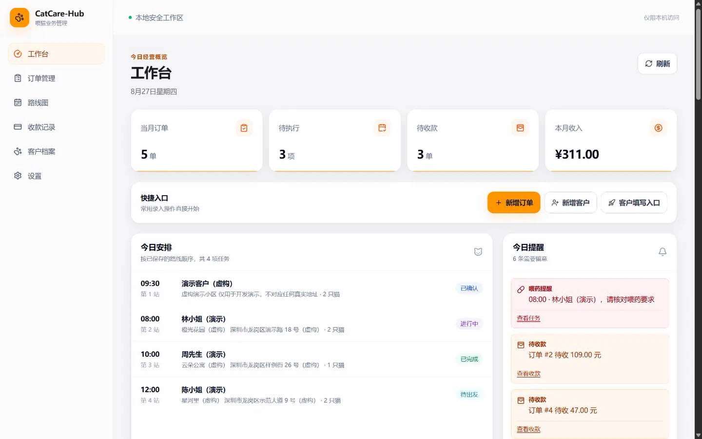
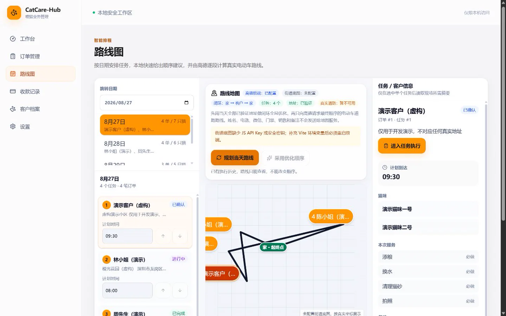
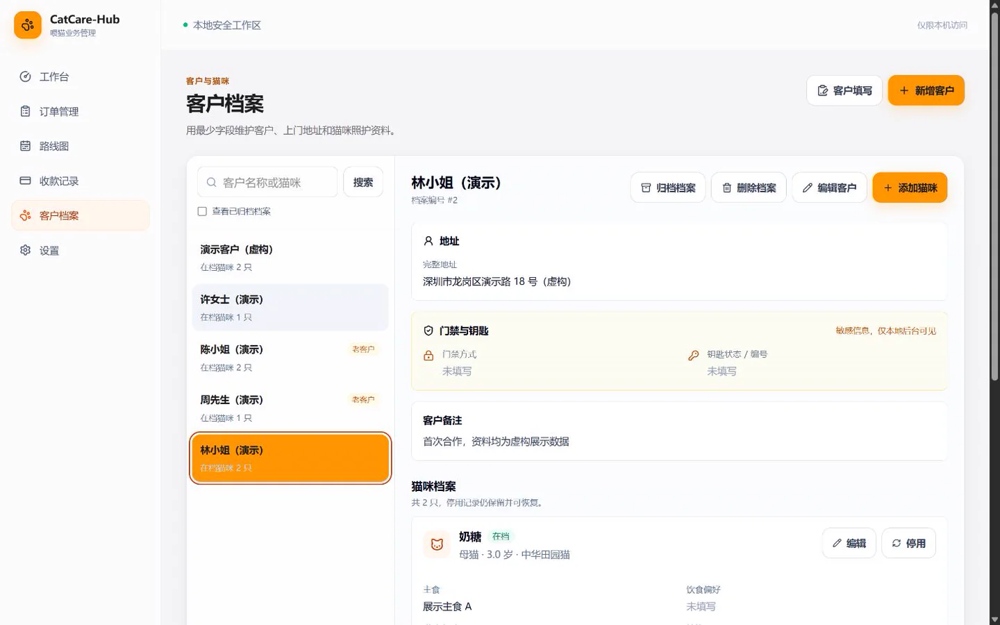
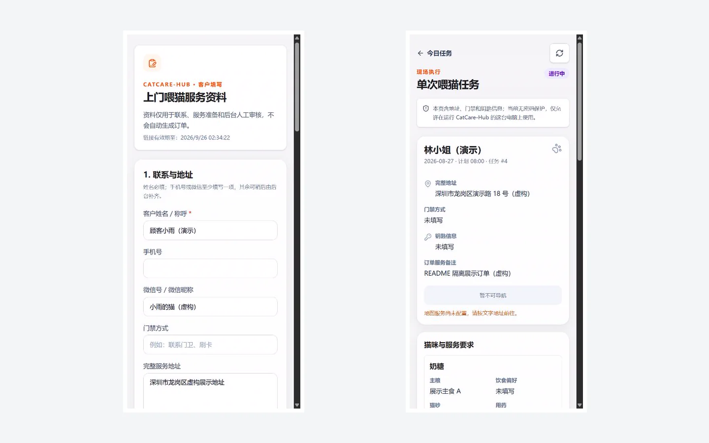
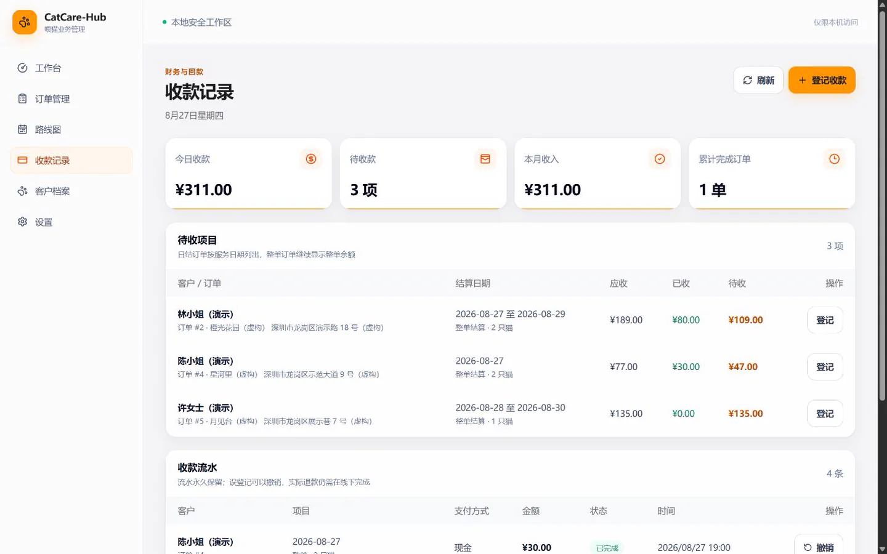
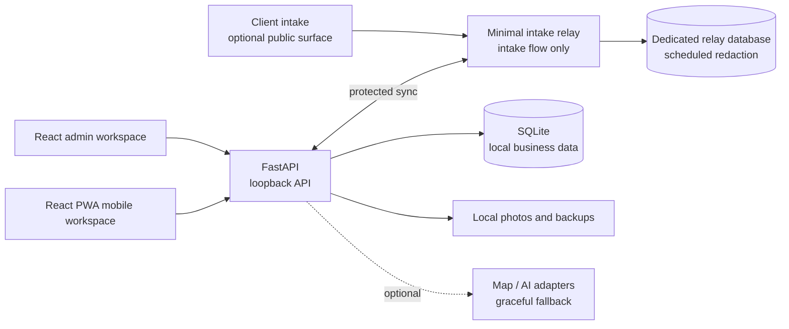

# CatCare-Hub

A local-first management system for independent cat sitters, bringing clients, cats, bookings, daily routes, visits, and payments into one workspace.

[简体中文](README.md) · [Product guide](docs/PRODUCT_GUIDE.md) · [Documentation](docs/README.md) · [Security boundaries](docs/SECURITY_AND_PRIVATE_ACCESS.md)

[](https://github.com/damingishere-coder/CatCare-Hub/actions/workflows/ci.yml)
[](LICENSE)




## What is CatCare-Hub?

CatCare-Hub is a local operations hub for small, independent cat-sitting businesses. It turns information that would otherwise live across chats, spreadsheets, maps, and bookkeeping tools into one executable service flow: collect client details, review and create a booking, plan daily visits and routes, record on-site work, and finish with payment tracking.

The application runs on your own Windows computer and stores business data in SQLite by default. The admin and mobile workspaces stay behind a loopback boundary. A separate, minimal public intake surface can be deployed when needed; the full management application must not be exposed to the public internet.

## Core Workflow

1. **Collect** — Create a one-time intake link for contact, cat, and service details. The original submission remains immutable.
2. **Review** — Check the submission, match or create client and cat records, and prepare a booking draft.
3. **Schedule** — Review visits by service date and calculate a home → clients → home route order.
4. **Visit** — Use the mobile workspace for the checklist, notes, photos, exceptions, and completion state.
5. **Settle** — Track totals, outstanding balances, partial payments, and an auditable payment history.

## Product Gallery

| Daily plan and route | Client and cat records |
| --- | --- |
| [](docs/assets/screenshots/daily-route.webp) | [](docs/assets/screenshots/customers.webp) |
| **Client intake and mobile execution** | **Payments workspace** |
| [](docs/assets/screenshots/mobile-workflows.webp) | [](docs/assets/screenshots/payments.webp) |

> Every screenshot uses an isolated showcase database and fictional seed data. The route image uses a deterministic demo provider and does not claim verified live AMap connectivity.

## Key Capabilities

| Area | Current capability |
| --- | --- |
| Today dashboard | Visits, reminders, revenue and booking metrics, plus intake review shortcuts |
| Clients and cats | Contact records, cat profiles, feeding and health notes, linked booking history |
| Bookings and schedules | Multi-day service, price snapshots, daily visit generation, review drafts, and archive rules |
| Route planning | Home → clients → home loop, ordering suggestions, address health, optional AMap e-bike routing |
| Visit execution | Mobile visit list, checklist, photos, exceptions, and completion state |
| Payments | Outstanding and partial payments, payment history, daily settlement, and void audit records |
| Client intake | One-time links, review flow, idempotency protection, and a 30-day relay retention policy |

## Why CatCare-Hub

The hard part of an independent cat-sitting service is rarely storing one contact. A single booking can span several dates, addresses, cats, care instructions, and on-site hand-offs. Generic CRMs are often too heavy, while a spreadsheet cannot reliably express the relationship between visits, routes, evidence, and settlement.

CatCare-Hub follows three restrained product principles:

- **Local first** — Sensitive operating data stays on the sitter's own device by default.
- **Booking first** — Intake, scheduling, execution, and payment all flow around the same booking.
- **Human controlled** — Route suggestions, intake review, and exceptions keep explicit confirmation and fallback paths.

## Technical Architecture



The admin workspace, mobile workspace, and business API listen on loopback by default. The public build and relay form a separate boundary, and the local API accesses the relay only with server-side credentials. A CloudBase deployment skeleton is included, but no live public deployment is claimed or verified. See [Architecture and data integrity](docs/ARCHITECTURE_AND_DATA.md) and [Security and private access](docs/SECURITY_AND_PRIVATE_ACCESS.md).

## Tech Stack

| Layer | Technology |
| --- | --- |
| Web | React 19, TypeScript, Vite, React Router, TanStack Query |
| API | FastAPI, SQLAlchemy 2, Pydantic |
| Data | SQLite, Alembic, file-system photo storage |
| Maps | Local route ordering, optional AMap adapter, deterministic fallback |
| Quality | Pytest, Vitest, ESLint, TypeScript, GitHub Actions |
| Delivery | Windows scripts, PWA shell, separate public intake build, CloudBase relay skeleton |

## Windows Quick Start

Requirements: Windows 10/11, Python 3.12+, and Node.js 20.19+.

```powershell
git clone https://github.com/damingishere-coder/CatCare-Hub.git
cd CatCare-Hub
setup.bat
start.bat
```

Open <http://127.0.0.1:5180/admin>. To add fictional demo data, run `seed.bat` before the first start.

The admin workspace has no login screen by default and is intended for a trusted local computer. Do not expose ports `5180` or `8000`, or the full management app, through a tunnel, port forward, or reverse proxy. See the [development guide](docs/DEVELOPMENT.md) for environment variables, migrations, seed data, and the complete command set.

## Documentation

- [Documentation hub](docs/README.md) — product, development, architecture, security, and history
- [Product guide](docs/PRODUCT_GUIDE.md) — roles, modules, and end-to-end operating flow
- [Architecture and data integrity](docs/ARCHITECTURE_AND_DATA.md) — data model, revisions, migrations, idempotency, and adapters
- [Development guide](docs/DEVELOPMENT.md) — setup, commands, tests, builds, and troubleshooting
- [Project status](docs/PROJECT_STATUS.md) — implemented scope, limitations, and roadmap
- [Security and private access](docs/SECURITY_AND_PRIVATE_ACCESS.md) — loopback boundary and minimal public intake exposure
- [Historical archive](docs/history/README.md) — early execution documents, development rounds, and status snapshots

## Project Status / Roadmap

CatCare-Hub is a **usable local-first V1 under active development**. The core operating loop works on a single computer; the project is neither a SaaS product nor labelled production-ready.

| Status | Scope |
| --- | --- |
| Available | Clients and cats, bookings, multi-day visits, dashboard, routes, mobile execution, payments, intake review |
| Improving | Backup and restore experience, public-intake deployment guidance, end-to-end observability, accessibility, mobile UX |
| Candidate | Optional multi-user permissions, notifications, additional map providers; these will only be claimed after real verification |

See [Project status and roadmap](docs/PROJECT_STATUS.md) for the detailed list.

## Current Limitations and Security Boundaries

- The admin workspace uses local no-auth mode and is not suitable for untrusted networks or shared servers.
- The PWA provides installation and an application shell; business data still requires the local API. Full offline execution is not promised.
- Payments are operational records, not a payment gateway, and do not collect money automatically.
- Map and AI integrations are optional adapters with explicit fallback behavior; suggestions are not automatic decisions.
- The CloudBase relay is a deployment skeleton for public intake only. This repository does not claim a live instance.
- Intake links, addresses, access instructions, key locations, and visit photos are sensitive and must not appear in logs, screenshots, or public issues.

## License

CatCare-Hub is released under the [MIT License](LICENSE).
