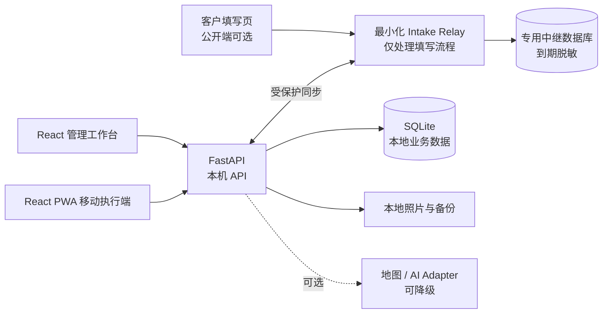

# CatCare-Hub

面向独立上门喂猫服务者的本地优先管理系统，把客户与猫咪档案、订单、排班路线、上门执行和收款放进一个工作台。

[English](README.en.md) · [产品指南](docs/PRODUCT_GUIDE.md) · [文档中心](docs/README.md) · [安全边界](docs/SECURITY_AND_PRIVATE_ACCESS.md)

[](https://github.com/damingishere-coder/CatCare-Hub/actions/workflows/ci.yml)
[](LICENSE)


## CatCare-Hub 是什么？

CatCare-Hub 是一个为小型、独立上门喂猫业务设计的本地管理中枢。它把原本散落在聊天记录、表格、地图和记账工具里的信息串成一条可执行的服务流程：客户提交资料，服务者审核并建立订单，系统按日期生成任务与路线，现场完成清单和记录，最后回到收款工作台结算。

系统默认运行在自己的 Windows 电脑和 SQLite 数据库中。后台与移动执行端采用本机工作区边界；客户填写页可按需通过独立、最小化的公开入口转发，不能把整个管理后台暴露到公网。

## 核心工作流

1. **收集资料** — 为客户生成一次性填写链接，接收联系人、猫咪和服务需求；原始提交内容保持不可变。
2. **审核建档** — 在审核工作台校对资料，匹配或创建客户与猫咪档案，并生成订单草稿。
3. **排班规划** — 按服务日期查看任务，计算从家出发、依次上门、最后回家的闭环顺序。
4. **上门执行** — 在移动端查看当天任务，完成 Checklist、现场记录、照片和异常说明。
5. **结算收款** — 汇总订单金额、待收项目、部分收款和流水；作废记录保留审计信息。

## Product Gallery

| 日计划与路线 | 客户与猫咪档案 |
| --- | --- |
| [](docs/assets/screenshots/daily-route.webp) | [](docs/assets/screenshots/customers.webp) |
| **客户填写与移动执行** | **收款工作台** |
| [](docs/assets/screenshots/mobile-workflows.webp) | [](docs/assets/screenshots/payments.webp) |

> 截图来自隔离的演示数据库，全部为虚构 Seed 数据。路线图使用确定性的演示 Provider，不代表本次已验证真实高德外部联通。

## 核心功能

| 模块 | 当前能力 |
| --- | --- |
| 今日工作台 | 今日任务、提醒、收入与订单指标、客户填写审核入口 |
| 客户与猫咪 | 联系资料、猫咪档案、喂养与健康备注、历史订单关联 |
| 订单与排班 | 多日服务、价格快照、按日生成任务、审核草稿与归档规则 |
| 路线规划 | 家 → 客户 → 家闭环、顺序建议、地址状态、可选高德电动车路线 |
| 上门执行 | 移动端任务列表、Checklist、照片、异常记录与完成状态 |
| 收款管理 | 待收款、部分收款、收款流水、订单日结与作废审计 |
| 客户填写 | 一次性链接、提交审核、幂等保护、30 天云端中继清理策略 |

## Why CatCare-Hub

独立上门喂猫的难点通常不在“记录一位客户”，而在一次服务跨越多个日期、多个地址、不同猫咪习惯和连续的现场交付。通用 CRM 过重，普通表格又无法可靠表达任务状态、路线、照片和结算之间的关系。

CatCare-Hub 选择三个克制的产品原则：

- **本地优先**：客户、地址、门禁等敏感经营数据默认保存在自己的设备上。
- **订单优先**：资料、排班、执行和收款围绕同一张订单流转，减少重复录入。
- **人工可控**：路线建议、资料审核和异常处理都保留清晰的人工确认与降级路径。

## Technical Architecture



管理后台、移动执行端和业务 API 默认只监听 loopback。公开端构建与 relay 是独立边界，本机 API 仅通过服务端凭据访问 relay；仓库提供 CloudBase 部署骨架，但尚未声明或验证真实公开部署。详见[架构与数据一致性](docs/ARCHITECTURE_AND_DATA.md)和[私有访问安全边界](docs/SECURITY_AND_PRIVATE_ACCESS.md)。

## Tech Stack

| 层级 | 技术 |
| --- | --- |
| Web | React 19、TypeScript、Vite、React Router、TanStack Query |
| API | FastAPI、SQLAlchemy 2、Pydantic |
| Data | SQLite、Alembic、文件系统照片存储 |
| Maps | 本地顺序优化、可选 AMap Adapter、确定性降级 |
| Quality | Pytest、Vitest、ESLint、TypeScript、GitHub Actions |
| Delivery | Windows 脚本、PWA Shell、独立公开填写构建、CloudBase relay 骨架 |

## Windows Quick Start

要求：Windows 10/11、Python 3.12+、Node.js 20.19+。

```powershell
git clone https://github.com/damingishere-coder/CatCare-Hub.git
cd CatCare-Hub
setup.bat
start.bat
```

浏览器打开 <http://127.0.0.1:5180/admin>。如需虚构演示数据，可在首次启动前运行 `seed.bat`。

默认后台没有登录页，只适合受信任电脑上的本机访问。不要把 `5180`、`8000` 或整个管理端通过 Tunnel、端口转发或反向代理暴露到公网。完整环境变量、迁移、Seed 和开发命令见[开发指南](docs/DEVELOPMENT.md)。

## Documentation

- [文档中心](docs/README.md) — 按产品、开发、架构、安全和历史分类的入口
- [产品指南](docs/PRODUCT_GUIDE.md) — 角色、模块和端到端操作流程
- [架构与数据一致性](docs/ARCHITECTURE_AND_DATA.md) — 数据模型、revision、迁移、幂等和 Adapter
- [开发指南](docs/DEVELOPMENT.md) — 环境、命令、测试、构建与故障排查
- [项目状态](docs/PROJECT_STATUS.md) — 已实现能力、限制与路线图
- [安全与私有访问](docs/SECURITY_AND_PRIVATE_ACCESS.md) — 本机边界和公开填写的最小暴露原则
- [历史档案](docs/history/README.md) — 早期执行文档、开发轮次和状态快照

## Project Status / Roadmap

CatCare-Hub 当前是**可用的本地优先 V1，持续开发中**。核心业务闭环已经可以在单机环境完成；它不是 SaaS，也不标记为 production-ready。

| 状态 | 范围 |
| --- | --- |
| 已实现 | 客户与猫咪、订单、多日任务、工作台、路线、移动执行、收款、客户资料填写审核 |
| 正在完善 | 更完整的备份恢复体验、公开填写部署手册、端到端可观测性、无障碍与移动体验 |
| 未来候选 | 可选的多用户与权限模型、通知集成、更多地图 Provider；只有完成真实验证后才会对外声明 |

详细清单见[项目状态与路线图](docs/PROJECT_STATUS.md)。

## 当前限制与安全边界

- 后台采用本机免登录模式，不适用于不受信网络或多人共享服务器。
- PWA 提供安装与壳层体验，任务业务数据仍需连接本机 API；不承诺完整离线执行。
- 收款模块记录业务流水，不接入支付网关，也不会自动收款。
- 地图和 AI 均为可选 Adapter；缺少密钥或外部服务不可用时会降级，不应把建议当作自动决策。
- CloudBase relay 仅是公开填写的部署骨架，本仓库目前未声明线上实例。
- 客户填写链接、地址、门禁、钥匙位置和现场照片都属于敏感信息，不应写入日志、截图或公开 Issue。

## License

CatCare-Hub 基于 [MIT License](LICENSE) 发布。
